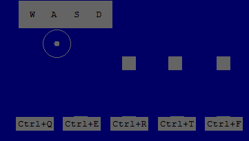

# Path of Exile 2 Keyboard Overlays

This folder contains different keyboard overlay styles for Path of Exile 2, designed for 2560x1440 resolution.

## Available Styles

### Movement Keys (WASD)

Simple text overlay for movement keys.

  
_Movement keys with minimalist text display_

### Glow Style

Shows skill and flask usage with glowing effects.

  
_Flask keys (1-2) with glow effect when pressed_

  
_Skill keys (QWERT) and mouse buttons with glow effect when pressed_

### Text Style

Simple text overlay, highlighting the key pressed with high white.

  
_Minimalist text overlay showing key presses_

## Features

### Movement

- WASD keys shown as plain text
- High contrast for better visibility
- No background images for clean appearance

### Combat

- Skill slots (QWERT) with glow effects
- Flask slots (1-2) with custom flask animations
- Mouse buttons and speed indicator included

### Display Options

- Glow style: Animated effects for skills and flasks
- Text style: Clean, minimal text overlay
- Mix of styles: Plain WASD with styled combat keys

## Resolution Support

Currently supports 2560x1440 resolution

## Installation

1. Choose your preferred style folder:
   - `2560x1440_glow/` for glow effects
   - `2560x1440/` for text overlay
2. Copy the corresponding files to your NohBoard installation

## Contributing

Feel free to contribute additional styles or resolution support by creating a pull request. At some point we will add a PR to the official NohBoard repo.
